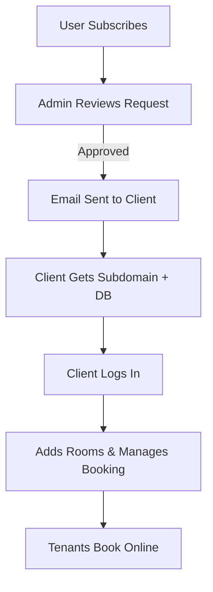
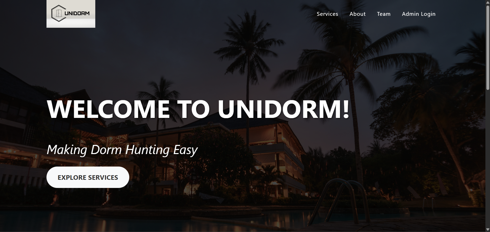
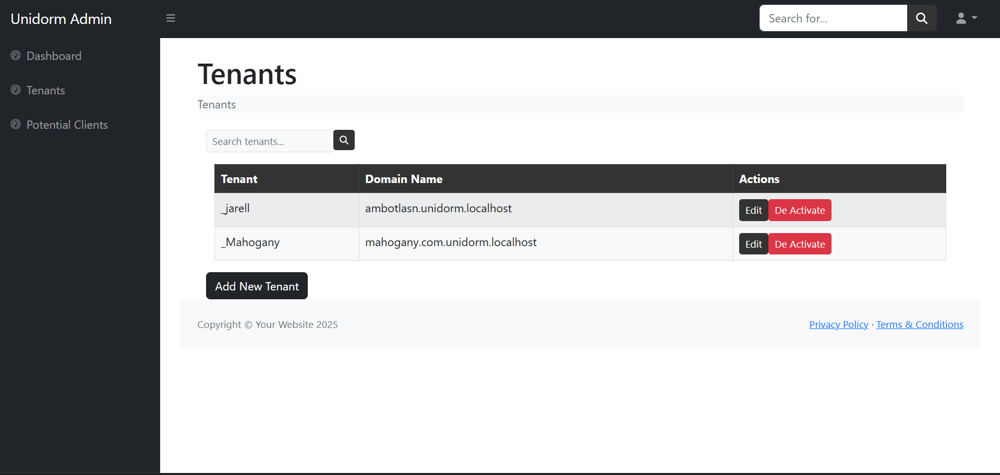
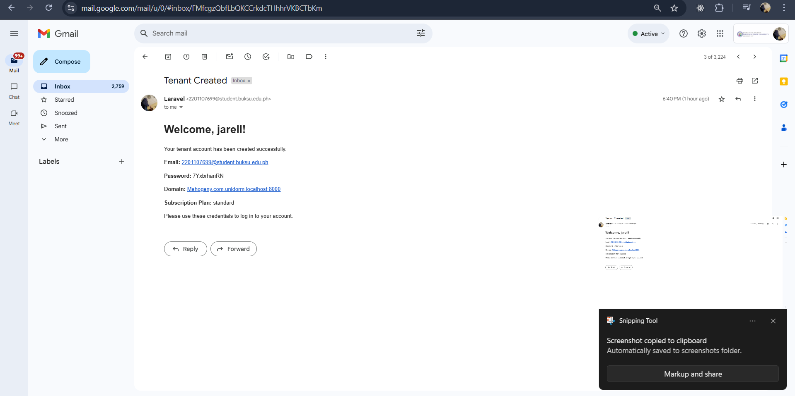
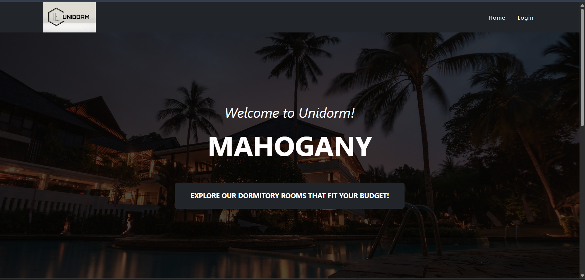
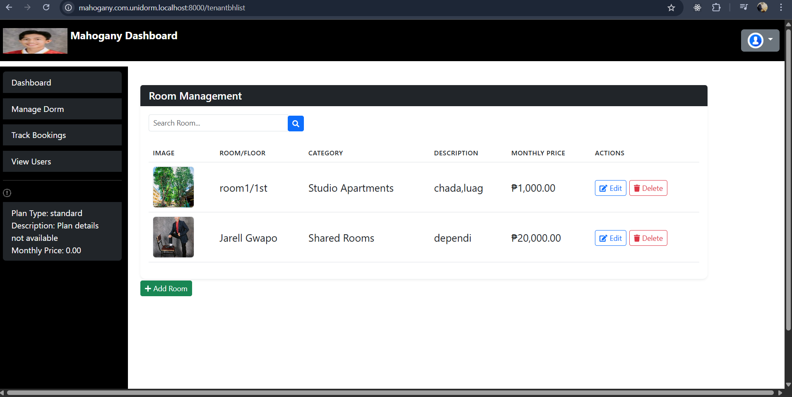
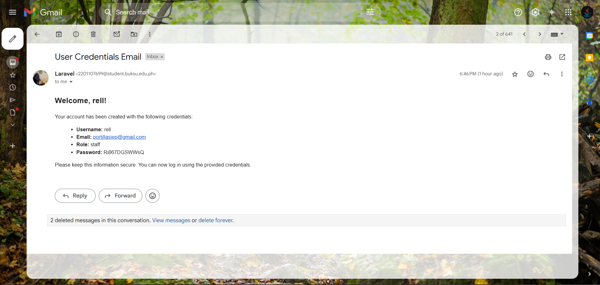
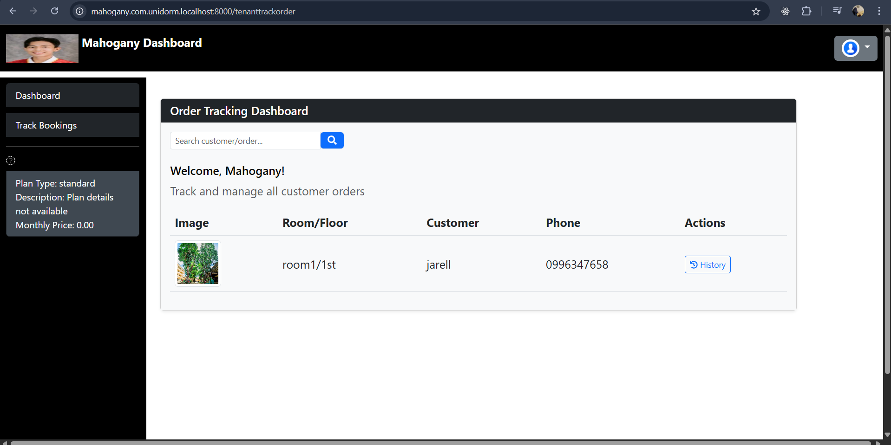
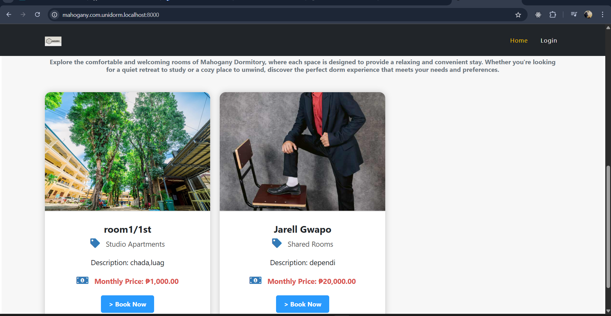

<p align="center">
  
</p>

<p align="center">
  
</p>

<h1 align="center">🏫 UniDorm - Multi-Tenant Dormitory Management System</h1>

<p align="center">
  
  
  
</p>

---

## 📌 Key Features

- 🔐 **Subscription & Approval Flow**
  - 📝 Clients subscribe via the main UniDorm website.
  - 👨‍💼 Admins approve or reject requests.
  - ✅ On approval:
    - 📧 Confirmation email is sent
    - 🗃️ Separate **database** is generated
    - 🌐 Unique **subdomain** is created (e.g., `clientname.unidorm.com`)

- 🏘️ **Dormitory Management**
  - Clients can:
    - ➕ Add and manage rooms
    - 📊 View room availability
    - 📅 Manage bookings

- 🛏️ **Room Booking System**
  - Tenants can:
    - 🌍 Visit client subdomain
    - 👀 View available rooms
    - 🛎️ Book directly online

---

## 🛠️ Tech Stack

| 💻 Component      | ⚙️ Description                            |
|------------------|--------------------------------------------|
| Laravel          | PHP Web Framework (v11+)                   |
| MySQL            | Relational Database                        |
| Tenancy for Laravel | Multi-Tenancy SaaS Management            |
| Laravel Mail     | Email Notifications                        |
| Bootstrap/CSS    | Frontend Styling                           |

---

- 🎯 **Clone the Repository**
    - 📥 Pull project from GitHub.
    - 🧭 Navigate to project directory.
```bash
git clone https://github.com/yourusername/unidorm.git  
cd unidorm
```
- 📦 **Install Dependencies**
    -💻 Install PHP packages
```bash
composer install
```
- 🎨 **Install JS dependencies & compile assets**
```bash
npm install && npm run dev
```
- ⚙️ **Environment Setup**
    - 🧪 Create .env file
```bash
cp .env.example .env
php artisan key:generate
```
- 🛠️ **Configure database & mail settings inside .env**

```dotenv

DB_DATABASE=unidorm_main  
DB_USERNAME=root  
DB_PASSWORD=yourpassword  

MAIL_MAILER=smtp  
MAIL_HOST=smtp.mailtrap.io  
MAIL_PORT=2525  
MAIL_USERNAME=your_mailtrap_username  
MAIL_PASSWORD=your_mailtrap_password  
MAIL_FROM_ADDRESS=admin@unidorm.com  
MAIL_FROM_NAME="UniDorm Support"
```
- 🧱 **Database Migration & Seeding**
    - 🗃️ Create tables & seed data

```bash
php artisan migrate --seed
```

- 🔑 **Default Admin Credentials**
    - 📧 Email: admin@unidorm.com
    - 🔒 Password: password

## 🚀 Project Flow

## 📸 Preview



---


---


---


---


---


---


---


---


